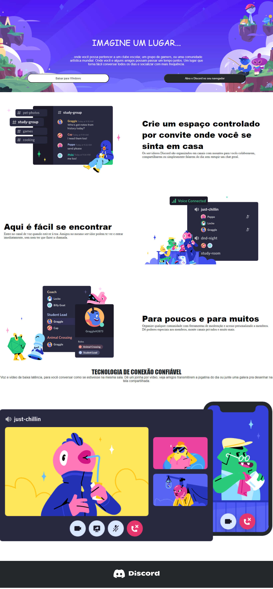

# Report on Responsive Web Page Development

## 1. Introduction
The goal of this project was to create a responsive web page with a modern and appealing layout. The page included elements such as images, texts, and buttons, designed to adapt to various screen sizes, providing a consistent user experience on different devices.

## 2. Methods
To achieve the project's objectives, standard web technologies such as HTML5 and CSS3 were employed. The HTML structure was organized semantically for improved accessibility and SEO. CSS3 was used for styling and page responsiveness.

- **Responsive Images:** The \`object-fit: cover\` property was utilized to ensure images covered their respective areas completely while maintaining proportion.

- **Responsive Layout:** Media query rules were implemented to adjust the layout based on screen size, ensuring a pleasant experience on mobile devices and desktop.

- **Responsive Text:** Viewport width (vw) units were adopted to make font size responsive to screen width, ensuring proper legibility.

## 3. Results
The results were satisfactory, with the page featuring a modern and adaptable design. However, some challenges were encountered:

- **Text Overlapping:** On smaller screens, text on images could overlap. This was addressed by adjusting positions and font sizes with specific media rules.

- **Button Overlapping:** On smaller screens, buttons were also overlapping. This was resolved by adjusting button positions and sizes with specific media rules.

## 4. Conclusion
The project was successfully completed, resulting in a responsive and aesthetically pleasing web page. The approach taken allowed overcoming challenges encountered during development, ensuring the page performs well across a variety of devices.

## 5. Use Case
Consider a digital marketing company looking to create a landing page to promote its services. Using the developed structure, the company can easily customize content, replace images, and adjust styles to meet its specific needs. The page's responsiveness will ensure potential clients have a positive experience accessing the page from their preferred devices, be it a laptop, tablet, or smartphone.

This report highlights the success of developing a responsive web page and how challenges were overcome to achieve project objectives.

# Report on Responsive Web Page Development

## 1. Introduction
The goal of this project was to create a responsive web page with a modern and appealing layout. The page included elements such as images, texts, and buttons, designed to adapt to various screen sizes, providing a consistent user experience on different devices.

## 2. Methods
To achieve the project's objectives, standard web technologies such as HTML5 and CSS3 were employed. The HTML structure was organized semantically for improved accessibility and SEO. CSS3 was used for styling and page responsiveness.

- **Responsive Images:** The \`object-fit: cover\` property was utilized to ensure images covered their respective areas completely while maintaining proportion.

- **Responsive Layout:** Media query rules were implemented to adjust the layout based on screen size, ensuring a pleasant experience on mobile devices and desktop.

- **Responsive Text:** Viewport width (vw) units were adopted to make font size responsive to screen width, ensuring proper legibility.

## 3. Results
The results were satisfactory, with the page featuring a modern and adaptable design. However, some challenges were encountered:

- **Text Overlapping:** On smaller screens, text on images could overlap. This was addressed by adjusting positions and font sizes with specific media rules.

- **Button Overlapping:** On smaller screens, buttons were also overlapping. This was resolved by adjusting button positions and sizes with specific media rules.

## 4. Conclusion
The project was successfully completed, resulting in a responsive and aesthetically pleasing web page. The approach taken allowed overcoming challenges encountered during development, ensuring the page performs well across a variety of devices.

## 5. Use Case
Consider a digital marketing company looking to create a landing page to promote its services. Using the developed structure, the company can easily customize content, replace images, and adjust styles to meet its specific needs. The page's responsiveness will ensure potential clients have a positive experience accessing the page from their preferred devices, be it a laptop, tablet, or smartphone.

This report highlights the success of developing a responsive web page and how challenges were overcome to achieve project objectives.

